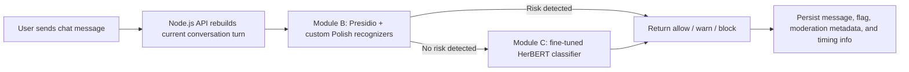
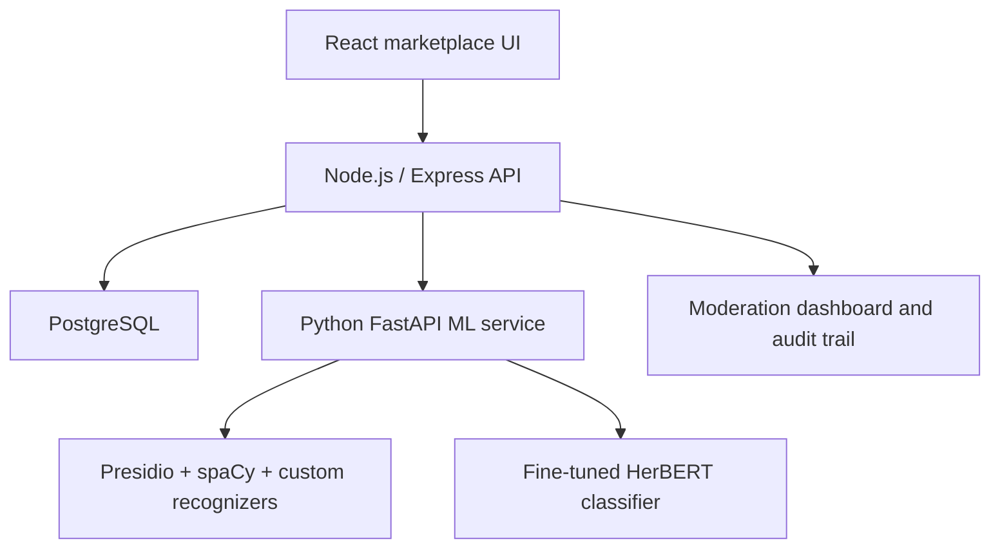

# Stylify

Stylify is a full-stack fashion marketplace with a production-style ML moderation system for detecting risky user messages in real time.

The project is built around a realistic ML engineering problem: users can try to bypass platform payments, share contact details, send payment scams, or post toxic content in chat. Stylify handles this with a hybrid inference pipeline combining deterministic PII/risk detection, a fine-tuned Polish transformer classifier, conversation-turn reconstruction, fallback logic, timing instrumentation, and a moderation review flow.

## Why This Project Matters

This is not only a marketplace CRUD app. The core engineering work is the integration of an ML safety system into a real product surface:

- A separate Python/FastAPI ML microservice deployed next to a Node.js/Express API.
- A hybrid moderation pipeline: Presidio + custom Polish regex recognizers first, HerBERT second.
- Conversation-turn analysis, not only single-message classification.
- A balanced labeled dataset stored as JSONL for four moderation classes.
- Runtime decisioning: allow, warn, or block.
- Graceful fallback when the ML service is unavailable.
- Timing instrumentation for measuring Presidio, HerBERT, and the full hybrid pipeline.
- Persistent moderation artifacts for audit and human review.

## ML Moderation Pipeline

Stylify implements a cascaded moderation design.



### Module B: Presidio + Custom Recognizers

The first stage is optimized for high-precision detection of explicit policy violations:

- Polish phone numbers
- email addresses
- Polish IBAN numbers
- credit card and CVV patterns
- BLIK requests
- advance payment requests
- phishing links
- social media handles
- platform-bypass phrases
- toxic phrase patterns

Implementation:

- [ml-service/presidio_detector.py](ml-service/presidio_detector.py)
- [ml-service/main.py](ml-service/main.py)

The detector maps low-level entities into moderation labels:

- `personal_data_request`
- `payment_scam`
- `platform_bypass`
- `toxic_content`
- `benign`

### Module C: Fine-Tuned HerBERT Classifier

The second stage handles messages that are not caught by the deterministic detector. It uses a local HerBERT sequence classification model with four classes:

- `benign`
- `bypass`
- `fraud`
- `toxic`

The FastAPI service loads model artifacts from:

```text
ml-service/models/herbert-finetuned/
```

and exposes:

```text
POST /classify/herbert
```

The model returns:

- top label
- confidence
- full label distribution
- action: `allow`, `warn`, or `block`

### Module D: Hybrid B + C Pipeline

The production pipeline is orchestrated by the Node.js API:

1. Reconstruct the current conversation turn.
2. Send the turn text to `/classify/presidio`.
3. If Presidio detects risk, return the decision immediately.
4. If Presidio allows the message, call `/classify/herbert`.
5. Compare classification on the latest message and full turn.
6. Pick the stricter result.
7. Save flags and moderation metadata.
8. If the ML service fails, fall back to deterministic server-side rules.

Implementation:

- [server/controllers/chatController.js](server/controllers/chatController.js)
- [server/utils/turns.js](server/utils/turns.js)
- [server/models/ConversationTurn.js](server/models/ConversationTurn.js)
- [server/models/MessageFlag.js](server/models/MessageFlag.js)

## Dataset

The repository includes processed JSONL datasets for the moderation task:

```text
ml-service/dataset/processed/
```

Current dataset distribution:

| Split | benign | bypass | fraud | toxic | Total |
|---|---:|---:|---:|---:|---:|
| train | 233 | 251 | 230 | 246 | 960 |
| test | 33 | 26 | 33 | 28 | 120 |
| full dataset | 300 | 300 | 300 | 300 | 1200 |

The labels are designed around marketplace abuse scenarios:

- `benign`: normal marketplace communication
- `bypass`: attempts to move the transaction outside the platform
- `fraud`: payment scams, suspicious payment behavior, phishing-like requests
- `toxic`: threats, insults, abusive content

## Latency Measurement

The Node.js API exposes an optional timing endpoint for measuring the real hybrid pipeline from the application layer.

It reports:

- Presidio time
- HerBERT time
- total hybrid pipeline time
- hybrid path completed after Presidio only
- hybrid path completed through Presidio + HerBERT

The endpoint is disabled by default and must be explicitly enabled:

```powershell
$env:ENABLE_LOAD_TEST_ENDPOINT="true"
docker compose up -d --force-recreate node
```

Run the timing script:

```powershell
cd server
$env:ITERATIONS="20"
npm.cmd run test:timing
```

Implementation:

- [server/tests/pipeline_timing_test.js](server/tests/pipeline_timing_test.js)

## System Architecture



## Tech Stack

### Machine Learning

- Python
- FastAPI
- Hugging Face Transformers
- PyTorch
- HerBERT sequence classification
- Microsoft Presidio
- spaCy Polish NLP pipeline
- Custom regex/entity recognizers
- JSONL datasets

### Backend

- Node.js
- Express
- PostgreSQL
- Sequelize
- JWT authentication
- Stripe integration
- Cloudinary integration

### Frontend

- React
- React Router
- Tailwind CSS
- Chart.js
- React Toastify

### Infrastructure

- Docker
- Docker Compose
- Separate containers for frontend, backend, database, and ML service

## Product Features

- Fashion marketplace with offers and product images
- User accounts and authentication
- User-to-user chat
- ML-powered chat moderation
- Message blocking and warning UX
- Moderation dashboard
- Flag persistence and review state
- Transactions and payment flow
- Reviews and seller ratings
- Notifications

## Local Development

Start the full stack:

```powershell
docker compose up -d --build
```

Backend only:

```powershell
cd server
npm install
npm start
```

Frontend only:

```powershell
cd client
npm install
npm start
```

ML service only:

```powershell
cd ml-service
pip install -r requirements.txt
uvicorn main:app --host 0.0.0.0 --port 8000
```

## Key API Endpoints

ML service:

```text
GET  /health
POST /classify/presidio
POST /classify/herbert
POST /classify
```

Node.js moderation path:

```text
POST /chat/add-message
POST /chat/classify
GET  /moderation/flags
POST /moderation/flags/:flagId/mark
POST /moderation/flags/:flagId/override
```

`POST /chat/classify` is intended for timing experiments and is available only when:

```text
ENABLE_LOAD_TEST_ENDPOINT=true
```

## ML Engineering Highlights

This project demonstrates practical ML engineering skills beyond model training:

- Designing a cascaded inference pipeline to reduce unnecessary transformer calls.
- Combining high-precision deterministic detectors with a semantic neural classifier.
- Serving ML through a dedicated FastAPI microservice.
- Integrating inference into a latency-sensitive chat workflow.
- Building observability into the pipeline through timing metadata.
- Preserving moderation decisions for auditability and human review.
- Handling model/service failure through deterministic fallback logic.
- Modeling conversation turns to detect fragmented policy violations.

## Repository Structure

```text
Stylify/
  client/                 React frontend
  server/                 Node.js API, chat, moderation, payments, persistence
  ml-service/             FastAPI ML service
    dataset/processed/    JSONL moderation datasets
    main.py               ML inference API
    presidio_detector.py  Presidio + custom Polish recognizers
  docker-compose.yaml     Multi-container local environment
```

## Suggested Resume Framing

> Built a production-style ML moderation system for a marketplace chat, combining Presidio, custom Polish entity recognizers, and a fine-tuned HerBERT classifier in a cascaded FastAPI microservice. Integrated the model with a Node.js application, conversation-turn reconstruction, fallback logic, moderation audit trail, and latency measurement for Presidio, HerBERT, and the full hybrid pipeline.
